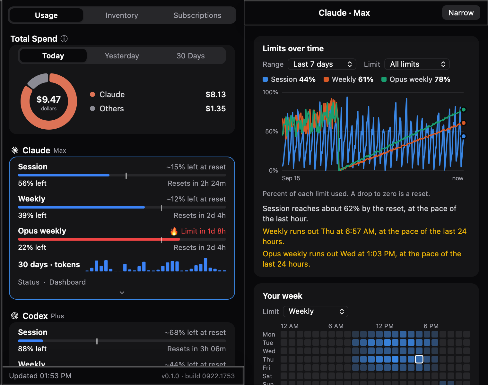

<div align="center">

# AI Task Manager

**Everything your AI tools are doing, in one place.**

One click on the menu bar (macOS) or system tray (Windows) answers the
questions every AI power user keeps asking: *How much of my Claude session is
left? When does my Codex weekly reset? What did today actually cost me? And
what are all these MCP servers doing in the background?*

macOS and Windows. No account, no cloud, no telemetry.



<sub>Wide mode, on a fictional machine: the browser demo's data, not anyone's real usage.</sub>

[Install](#install) · [How it works](#how-it-works) · [Providers](#providers) ·
[What is in the app](#what-is-in-the-app) · [Privacy](#privacy-and-security) ·
[Build](#build-and-develop) · [Credits](#credits)

</div>

---

## Install

### Read this first

**No release has been cut yet**, so there is nothing to download. There is
also no code signing certificate on either platform, so builds are unsigned
and both operating systems will say so.

That leaves one path that works today: **build it yourself.** It takes about
ten minutes the first time and needs no certificate, no account and no admin
rights. Everything below is written for that path, with the "someone handed me
a build" steps beside it for when that day comes.

| | State today |
|---|---|
| Downloadable release | None. `release.yml` builds installers for a `v*` tag but has never been run. |
| macOS signing | None. No Apple Developer ID certificate is configured, so `spctl` reports "no usable signature" on any build. |
| Windows signing | None. SmartScreen will warn on any installer. |
| Auto-update | **Opt-in, off by default.** See [Updates](#updates). |

### macOS

**Prerequisites**

- **Xcode Command Line Tools**: `xcode-select --install`
- **Rust** (stable), from [rustup.rs](https://rustup.rs). Use the official
  installer, not Homebrew: Homebrew has no bottle for Intel macOS 26 and will
  build LLVM from source, which takes hours.
- **Node.js 20 or newer**, from [nodejs.org](https://nodejs.org) or `brew install node`.

**Build and install**

```sh
git clone https://github.com/agilepeter/ai-task-manager
cd ai-task-manager
npm install
npm run tauri build -- --bundles app,dmg
```

The first build compiles the whole Rust dependency tree and takes roughly ten
minutes. Later builds take seconds.

You get two things under `target/release/bundle/`:

- `macos/AI Task Manager.app` -> drag it to `/Applications`
- `dmg/AI Task Manager_0.1.0_<arch>.dmg` -> the same app, packaged to hand to
  someone else

Open the app. It lives in the **menu bar**, not the Dock: the app runs as a
macOS Accessory, so there is deliberately no Dock icon and no entry in the app
switcher. Look for the small robot glyph near the clock and click it.

> **An app you built yourself opens normally.** macOS applies its quarantine
> flag to things that *arrive* (downloads, AirDrop, a copied disk image), not
> to something you compiled locally, so Gatekeeper stays out of your way. The
> steps below are only for a build that came from somewhere else.

**Installing a .dmg someone sent you**

Because the build is unsigned, double-clicking it will fail with *"Apple could
not verify..."* or *"is damaged and can't be opened"*. Neither is true; both
mean unsigned. Either:

1. Open the `.dmg` and drag the app to `/Applications`.
2. **Right-click the app > Open**, then confirm. macOS remembers the choice, so
   you only do this once.

or, if the right-click route is blocked by your machine's policy, strip the
quarantine flag yourself:

```sh
xattr -dr com.apple.quarantine "/Applications/AI Task Manager.app"
```

**Uninstall**

```sh
rm -rf "/Applications/AI Task Manager.app"
rm -rf ~/Library/Application\ Support/AITaskManager
```

The second line removes your settings, saved keys and local history. Leave it
out to keep them for a reinstall.

### Windows

**Prerequisites**

- **Visual Studio C++ Build Tools** (the "Desktop development with C++"
  workload), from
  [visualstudio.microsoft.com/visual-cpp-build-tools](https://visualstudio.microsoft.com/visual-cpp-build-tools/)
- **Rust** (stable-msvc), from [rustup.rs](https://rustup.rs)
- **Node.js 20 or newer**, from [nodejs.org](https://nodejs.org)
- **WebView2**: already present on Windows 11 and on up-to-date Windows 10. If
  it is missing, the
  [Evergreen Runtime](https://developer.microsoft.com/microsoft-edge/webview2/)
  installs it.

**Build and install**

```powershell
git clone https://github.com/agilepeter/ai-task-manager
cd ai-task-manager
npm install
npm run tauri build
```

Installers land in `target\release\bundle\`:

- `nsis\AI Task Manager_0.1.0_x64-setup.exe` -> per-user install, no admin
- `msi\AI Task Manager_0.1.0_x64_en-US.msi` -> for Group Policy or scripted rollout

Run either one, then look for the icon in the system tray next to the clock and
click it.

**Installing an installer someone sent you**

The installer is not code-signed, so Windows shows **"Windows protected your
PC."** Click **More info > Run anyway**. There is no way around this short of a
code-signing certificate.

Silent install, for scripts: `"AI Task Manager_0.1.0_x64-setup.exe" /S`

**Uninstall**

Settings > Apps > Installed apps > AI Task Manager > Uninstall. To remove your
settings, saved keys and history as well, delete `%APPDATA%\AITaskManager`.

### Releases

Once a `v*` tag is pushed, `.github/workflows/release.yml` builds a macOS
universal bundle and Windows installers and attaches them to a **draft**
release. Until that runs and the artifacts are signed, building from source
above is both the supported path and the better one: you can read what you are
running.

## How it works

A small Tauri v2 app: a Rust core doing the data work, a vanilla TypeScript UI
doing the glass. No Electron, no background service, no account.

**1. Finding your accounts.** The CLIs and editors you already use keep their
logins in well-known per-user places. Claude Code writes `~/.claude/` (or the
login Keychain on macOS), Codex CLI writes `~/.codex/auth.json`, the GitHub CLI
uses the OS credential store, Cursor uses a local database, and so on. The app
reads those same files, or takes an API key you paste into Settings, and shows
a card for every tool it finds. Tools it cannot find start disabled, so there
are no dead cards. If a card is empty and you expected data, **Settings >
Sign-ins** lists every location that provider checked on *your* machine and
whether it was there.

**2. Asking the vendors.** Every few minutes each provider's token goes to
**its own vendor's API and nowhere else**, the same usage endpoints the
vendors' own apps use. Cards update with sessions, weekly windows, credit
balances and reset times. A provider that starts failing is benched briefly and
its last good data is shown with an "Outdated" tag rather than a blank card.

**3. Pacing the burn.** Every metric with a reset window gets a projection: at
this rate, will you make it to the reset? Bars turn amber and red as the maths
worsens, and optional system notifications fire once per window. A separate
**Burning Fast** rule catches what pacing cannot: a limit that jumped many
points inside thirty minutes, which is what an agent fan-out looks like early
in a week.

**4. Counting the money.** Your CLIs already log every request locally. The app
scans those logs, prices each request with live per-model rates, and draws the
Today / Yesterday / 30-day breakdown by model, project and day. On a flat-rate
plan this is what your usage *would* cost at API prices, which is the best
argument for your subscription you will ever see.

> **Spend figures are a floor, not a bill.** Measured against the vendor's own
> recorded cost, this app reads about 23% low on Claude, because Claude Code
> bills 1-hour cache writes at twice the input rate and the catalogue assumes
> the 5-minute rate. The app checks itself against that reference and says so
> in Inventory > Audit rather than quietly reporting a number it cannot stand
> behind.

**5. Staying local.** All of the above happens on your machine. There is no
account, no analytics, and your quotas, spend, folder names and provider data
never leave the computer. See [Privacy](#privacy-and-security).

## Providers

23 providers. How each one connects, in short. The full reference, one
section per provider with every file read and every endpoint called, is
[docs/providers.md](docs/providers.md).

| Provider | Source |
|---|---|
| Claude (Claude Code) | CLI login (login Keychain on macOS, `.credentials.json` elsewhere) + Anthropic usage API. Multi-account: every discovered config dir gets its own card. |
| Codex (Codex CLI) | `~/.codex/auth.json` + ChatGPT usage API, including reset-credit redemption. Multi-account. |
| Cursor | Cursor's local state database + usage RPC, with `cursor.com` usage summary as fallback |
| OpenCode | Official account-wide usage API, plus local `opencode.db` for spend |
| GitHub Copilot | Copilot editor login or GitHub CLI token in the OS credential store + GitHub API |
| Grok (Grok CLI) | `~/.grok/auth.json` + Grok billing APIs |
| Devin (Devin CLI) | CLI credentials + GetUserStatus RPC; local session store for spend |
| Antigravity | Local language server, or Google Cloud Code API via the OS credential store |
| Hermes | Local ledger from the Hermes desktop app: recent models, routes, catalog-priced spend |
| Qwen Code | Coding Plan key -> 5h / weekly / monthly request quotas + local spend |
| Kimi Code | `kimi login` or a pasted plan key -> session + weekly bars and membership tier |
| Kimi API | Platform API key -> wallet balance and credits-used meter (global + CN) |
| MiniMax | API key (Settings, env var or CLI config) + token-plan API |
| OpenRouter | API key, or a key already stored by OpenCode |
| Z.ai | API key, CLI key file, or env var |
| DeepSeek | API key -> balance |
| ElevenLabs | API key -> character quota with reset pacing |
| Codebuff | `codebuff login` credentials or API key -> credits + weekly limit |
| Kilo | Kilo CLI login or API key -> credit blocks + Kilo Pass |
| AihubMix | API key (or auto-detected from OpenCode) -> usage against spending limit |
| One/New API | Add any number of compatible sites and keys; one quota card per key |
| Sub2API | Compatible site keys, one card per key |
| Ollama | Local server on `:11434`. Installed and loaded models, no key. |

**On platform coverage, honestly.** This app is a clean copy of a Windows
original, so the Windows credential paths are inherited and exercised. On
**macOS only Claude and Copilot are verified end to end**; Codex, Cursor,
OpenRouter and ElevenLabs use paths that compile and look right but have not
been confirmed against a real signed-in machine. Antigravity discovery shells
out to PowerShell and `netstat`, so on macOS it compiles and finds nothing.
**Inventory > Sign-ins** marks exactly which providers are verified on the
platform you are running, so the app never lets a guess look like a fact.

## What is in the app

Three tabs.

**Usage** (the default) is the limits, pace bars and spend. Click any card's
name for a detail page: limits over time from a local 90-day history, spend
grouped by model, project or day, a 7x24 heatmap of when a limit actually gets
used, and a forecast that says when you run out at your recent rate. Click a
work area or a day to see the sessions behind it, or group Spend by Session for
every session of the last 30 days with its age and size. Each row has a Reveal
button that shows the log file so you can archive it yourself; the app never
deletes one, because those logs are also where its spend figures come from.

**Subscriptions** is your own ledger of what you pay. It never guesses a price:
a detected plan names a tier, not what it costs you. It steps renewal dates
from an anchor without drift, reminds you once before a renewal, and shows each
subscription's 30-day API-equivalent value against its monthly cost. "Idle"
requires measured low usage; a tool with no spend data says "no data".

**Inventory** is the setup itself: MCP servers, agents, skills and guardrails
across every MCP-capable app it knows (Claude Code, Claude Desktop, VS Code,
Cursor, Windsurf, Gemini CLI, Codex). **Running now** reads the process table
and shows which of those servers are actually running, grouped by runner, with
their memory, and lets you end one. **Audit** scores the whole setup: every
finding is computed from your machine, states its own numbers, and disappears
when it no longer applies. Nothing is graded twice, and what cannot be judged
is left out rather than counted against you. If you came looking for an MCP
manager, this tab is it: every server, what it runs, whether it is pinned, and
which copies are live.

Also: work areas and client attribution with CSV export, budget alerts per
client, an optional weekly digest, a read-only [local HTTP
API](docs/local-http-api.md) on `127.0.0.1:6736`, light and dark themes, a
global shortcut, and a wide mode that grows the same window rather than
opening a second one.

**Languages.** English, 中文, Русский, Español, Français, Deutsch, 日本語,
Português (Brasil) and 한국어 -- nine in total. The app follows the system
language by default, and any of the nine can be chosen instead in Settings.
Translation reaches every view, including findings, audit checks,
notifications and the tray tooltip; model ids, area and client names, and
`$`/`%` figures stay as data rather than prose. CSV headers translate too,
but the numbers inside an export keep the app's own plain formatting rather
than switching to the active locale's.

## Privacy and security

The app reads credential files. You should not take anyone's word for how it
treats them, so here is the contract and where to check it. The long version,
including every network call the app can make and the greps that prove it, is
[docs/privacy.md](docs/privacy.md).

- **No telemetry and no phone-home.** There is no analytics SDK, no install
  counter, no crash reporter and no in-app switch to find, because there is
  nothing to switch off. The upstream project's PostHog module was removed
  rather than disabled.
- **Outbound traffic is each provider's own vendor API**, and nothing else,
  with one documented exception: the **MCP Trust Index lookup**, which is
  **off by default**. Turned on, it sends nothing about your machine: one
  parameterless GET of a public list, at most once a day, matched locally.
- **Credentials are read, never copied out.** Inventory reads names, shapes and
  counts only. MCP config files routinely hold API keys in `env`, `args`,
  `headers` and URL query strings, and a test plants secrets in every one of
  those fields and asserts none of them reach any output.
- **OS credential stores are read-only.** On macOS the Claude provider reads
  the Keychain and deliberately never refreshes the token, because refreshing
  rotates it and would sign Claude Code out from under you.
- **Your folder names stay on your machine.** Work areas and client names are
  never published to the local HTTP API by default; the extra feeds that would
  expose them are opt-in and loopback-only, with a DNS-rebinding host check so
  a web page cannot read them through your browser.
- **The app changes your machine in exactly two places, both behind an explicit
  confirmed click**: ending a running MCP server, and pinning an unpinned MCP
  package to a version. The second takes its version from your local package
  cache, replaces one JSON string byte for byte, re-parses to prove nothing
  else moved, refuses if the file changed since the preview, and leaves a
  backup beside it.
- **Prompts and conversation titles are never read.** Claude Code stores titles
  derived from your prompts in the same logs the spend scanner walks. It skips
  them on purpose.

## Updates

**Self-update is opt-in and off by default** (Settings > Network > "Check for
updates", the `updateChecks` config key). While it is off, nothing goes out.
Turning it on makes exactly one kind of request -- a GET of `latest.json` from
this project's own release feed on `github.com`, sent on launch and every 4
hours after that, carrying nothing about you or this computer. See
[docs/privacy.md](docs/privacy.md) for the full accounting and `SHIPPING.md`
for what each remaining distribution step needs.

The feed itself does not exist yet because this repository has never cut a
release, so turning the setting on today just means a logged 404 every 4
hours. Until a release exists, update by pulling and rebuilding:

```sh
git pull
npm install
npm run tauri build -- --bundles app,dmg   # or: npm run tauri build   (Windows)
```

## Build and develop

```sh
npm install
npm run tauri dev      # run with hot reload
cargo test --workspace # prints its own total at the end
npm test               # prints its own total at the end
```

`npm run tauri dev` only watches `src-tauri/`. A change under `crates/` needs
the app restarted by hand.

Checking real numbers against the running app: `curl http://127.0.0.1:6736/v1/usage`.

The repository layout, the rules that hold it together and the reasoning behind
the non-obvious parts are in [CLAUDE.md](CLAUDE.md). Distribution status is in
[SHIPPING.md](SHIPPING.md). What came from upstream and how to take a fix from
it is in [UPSTREAM.md](UPSTREAM.md).

## Questions

The [FAQ on the product page](https://staas.fund/task-manager/#faq) answers the
ones that come up first: why there is no download, whether anything leaves the
machine, why a row can sit at 100% after a weekly reset, why the spend figures
are a floor, and whether it will delete old sessions (it will not).

## Credits

Built on two projects that did the hard provider research first, both MIT:

- **[Pane](https://github.com/ItsJazii/pane)** by Jazii, the Windows tray app
  this grew from.
- **[OpenUsage](https://github.com/robinebers/openusage)** by Robin Ebers, the
  macOS original and the provider research.
- **[CodexBar](https://github.com/steipete/CodexBar)** by Peter Steinberger,
  provider research for Codebuff, Kilo, Kiro, Amp, Vertex AI, Bedrock, Poe,
  Chutes, Warp and Crof.

Their copyright notices are kept in [LICENSE](LICENSE) and in the app's About
panel. If you fork this, keep them.

MIT licensed. Made by [StaaS Fund](https://staas.fund/).
